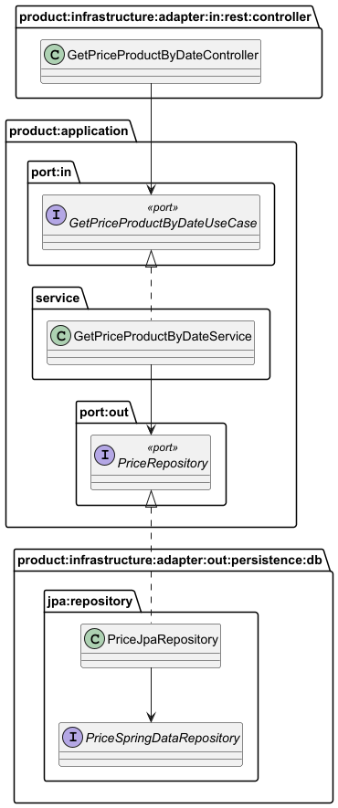

## Test Inditex - BCNC Group

> Aplicación para gestionar precios de productos basados en fechas específicas.
> La implementación ha sido realizada utilizando arquitectura hexagonal basado en casos de uso.

## Tabla de Contenidos

- [Integración continua y calidad de código](#integración-continua-y-calidad-de-código)
- [Tecnologías necesarias](#tecnologías-necesarias)
- [Arquitectura Hexagonal](#arquitectura-hexagonal)
- [Instalación del proyecto](#instalación-del-proyecto)
- [Funcionalidades](#funcionalidades)
- [Ejecución](#ejecución)
- [Ejecución API](#ejecución-api)
- [Pruebas](#pruebas)
- [Estructura del proyecto](#estructura-del-proyecto)
- [Diagrama de arquitectura plantuml](#diagrama-de-arquitectura-plantuml)
- [Contacto](#contacto)

### Integración Continua y calidad de Código

[](https://github.com/Nemn120/test-inditex-bcnc/actions/workflows/build.yml)
[](https://sonarcloud.io/summary/new_code?id=Nemn120_test-inditex-bcnc)

El proyecto utiliza GitHub Actions para el despliegue continuo y SonarCloud para medir la calidad del código y la
cobertura.

### Tecnologías necesarias

`Java 17` `Spring Boot` `Spring Data` `MapStruct` `Gradle` `JUnit5` `Mockito` `Sonarcloud`

### Arquitectura Hexagonal

La aplicación está diseñada siguiendo principios de arquitectura hexagonal, utilizando las siguientes capas:

#### 1. Dominio (`domain`)

La capa de dominio contiene las entidades de dominio y las reglas de negocio independiente a cualquier dependencia
externa.

- **Entidades de dominio**:
    - `Price.java`, `Currency.java`

- **Excepciones y Mensajes de Error**:
    - `DomainErrorMessage.java`: Define mensajes de error específicos para el dominio.
    - `DomainValidationException.java`: Maneja excepciones de validación del dominio.
    - `PriceNotFoundException.java`: Excepción lanzada cuando no se encuentra un precio específico.

#### 2. Aplicación (`application`)

Esta capa orquesta el flujo de trabajo entre la capa de dominio y la capa de infraestructura.

- **Puertos (`port`)**
    - `port.in`: Interfaces de entrada, como `GetPriceProductByDateUseCase.java`, que representa un caso de uso para
      obtener un precio de producto en una fecha específica.
    - `port.out`: Interfaces de salida, como `PriceRepository.java`, que actúa como contrato para el acceso a los datos
      de precios.


- **Servicios de Aplicación (`service`)**: Implementan la lógica de los casos de uso y dependen de los puertos para
  interactuar con la infraestructura:
    - `GetPriceProductByDateService.java`: Implementa el caso de uso de consulta de precios y se conecta
      a `PriceRepository` para acceder a los datos.

#### 3. Infraestructura (`infrastructure`)

Esta capa contiene los **adaptadores de entrada y salida** que interactúan con tecnologías externas, como REST o la base
de datos.

- **Adaptadores de Entrada (`adapter.in`)**: Permiten que el sistema reciba peticiones externas.
    - `rest.controller`: `GetPriceProductByDateController.java` expone un endpoint REST para consultar precios.
    - `dto`: Clases para exponer datos para la API como `ProductPriceRateResponseDTO.java` ,
    - `mapper`: `PriceRestMapper.java` convierte las entidades del dominio en DTOs.


- **Adaptadores de Salida (`adapter.out`)**: Conectan la aplicación con dependencias externas.
    - `persistence.db.jpa`: Implementa la persistencia con JPA para la BD.
        - `entity`: Define las entidades JPA (`PriceJpaEntity.java`).
        - `repository`: `PriceJpaRepository.java` implementa el puerto `PriceRepository`
            - `PriceSpringDataRepository.java` Se utiliza para realizar operaciones CRUD en `PriceJpaRepository.java`.
        - `mapper`: `PriceJpaMapper.java` convierte las entidades JPA en entidades de dominio.


- **Configuración (`config`)**:
    - `ApplicationServiceConfig.java`: Crea los beans de la capa aplicacion como `GetPriceProductByDateService`.
    - `SpringBootRun.java`: Contiene la configuración para el arranque de la aplicación asi como el escaneo de las
      entidades, repositorios y beans.
    - `SwaggerConfig.java`: Configuración de Swagger para la documentación de la API.

### Instalación del proyecto

1. Clonar el repositorio en tu equipo, **mediante consola**:

```sh
> cd <folder path>
> git clone https://github.com/Nemn120/test-inditex-bcnc
```

2. Importar el proyecto mediante **IntelliJ IDEA**
    1. **Import Project**, y seleccionar la carpeta del proyecto.
    1. Marcar **Create Project from external model**, elegir **Maven**.
    1. **Next** … **Finish**.

### Funcionalidades

1. **Consulta de Precios**: Permite obtener el precio de un producto en una fecha específica a partir de brandId,
   productId.
2. **Validaciones**:
    - Se valida que la fecha de inicio y la fecha de fin de los precios no se solapen.
    - Se verifica que los precios estén dentro del rango de fechas de los productos.
3. **Manejo de Prioridades**:
    - La aplicación devuelve el precio con la mayor prioridad.
    - Si hay más de un precio con la misma prioridad, se lanza un error.

### Ejecución

#### Ejecutar

Para levantar el proyecto es necesario Java17 y Gradle 7.3 como mínimo. Puede ejecutarlo directamente desde el IDE.

```
./gradlew bootRun
```

#### Ejecutar imagen

```
docker build -t test-inditex .
docker run -p 8080:8080 test-inditex
```

### Ejecución API

#### Request:

```
curl --location 'http://localhost:8080/api/v1/prices/brand/1/product/35455?applicationDate=2020-06-14T10:00:00.000-05:00'
```

#### Swagger:

```
http://localhost:8080/swagger-ui.html
```

#### Response:

```json

{
  "productId": 35455,
  "brandId": 1,
  "priceList": 1,
  "startDate": "2020-06-14T00:00:00",
  "endDate": "2020-12-31T23:59:59",
  "finalPrice": "35.50 €"
}
```

### Pruebas

Existen distintas manera de resolver la prueba. Una de las soluciones mas optimas seria una consulta mas elaborada y
delegar mayor responsabilidad a la BD. Sin embargo consideré oportuno realizar una consulta base a partir de los datos
ingresados y
delegar al dominio la decisión de retornar el precio con mayor prioridad. Esta elección me permitio probar distintos
escenarios
independientes de la base de datos con la facilidad de agregar mas criterios enriqueciendo el dominio.

- Las cinco pruebas del enunciado están desarrolladas en la clase de test GetPriceProductByDateControllerTest.
- Adicional a ello tambien se realizó las pruebas en las distintas capas de la arquitectura.
- Para los servicios rest se utilizó WebTestClient. La configuración está centralizada en la anotación @RestTestConfig
- Para los servicios de la capa de aplicación se utilizó Mockito con Junit.

#### Ejecutar los test:

```
./gradlew test
```

#### Ejecutar solicitudes HTTP con los 5 test de la prueba

Para probar los endpoints de la API que contiene los cinco test de la prueba. Puedes ejecutar directamente el archivo
[`test-prices.http`](./docs/test-prices.http) desde el Intellij.

### Estructura del proyecto

#### Arbol de directorio

```bash
 \---com.achavez.bcnc.inditextest.product
		    +---application
                    |   +---port
                    |   |   +---in
                    |   |   |       GetPriceProductByDateUseCase.java
                    |   |   |
                    |   |   \---out
                    |   |           PriceRepository.java
                    |   |
                    |   \---service
                    |           GetPriceProductByDateService.java
                    |
                    +---domain
                    |       Currency.java
                    |       DomainErrorMessage.java
                    |       DomainValidationException.java
                    |       Price.java
                    |       PriceNotFoundException.java
                    |
                    \---infrastructure
                        +---adapter
                        |   +---in
                        |   |   \---rest
                        |   |       +---controller
                        |   |       |       GetPriceProductByDateController.java
                        |   |       |
                        |   |       +---dto
                        |   |       |       ProductPriceRateResponseDTO.java
                        |   |       |
                        |   |       +---error
                        |   |       |       ErrorResponse.java
                        |   |       |       RestExceptionHandler.java
                        |   |       |
                        |   |       \---mapper
                        |   |               PriceRestMapper.java
                        |   |
                        |   \---out
                        |       \---persistence
                        |           \---db
                        |               \---jpa
                        |                   +---entity
                        |                   |       PriceJpaEntity.java
                        |                   |
                        |                   +---mapper
                        |                   |       PriceJpaMapper.java
                        |                   |
                        |                   \---repository
                        |                           PriceJpaRepository.java
                        |                           PriceSpringDataRepository.java
                        |
                        \---config
                                ApplicationServiceConfig.java
                                SpringBootRun.java
                                SwaggerConfig.java

```

#### Diagrama de arquitectura plantuml



## Contacto

[](https://www.linkedin.com/in/fernando-chavez-chavez/)
[](https://github.com/Nemn120/)
